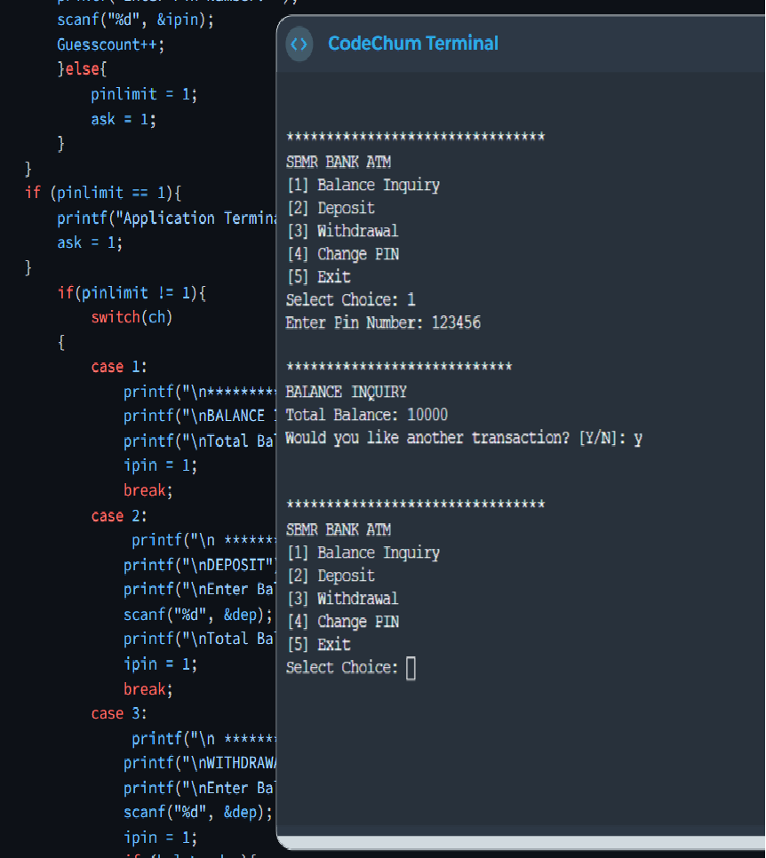

<!DOCTYPE html>
<html lang="en">
<head>
    <meta charset="UTF-8">
    <meta http-equiv="X-UA-Compatible" content="IE=edge">
    <meta name="viewport" content="width=device-width, initial-scale=1.0">
    
    <title>Bart Jason</title>

    <link rel="stylesheet" href="styles.css">
    <link rel="stylesheet" href="header.css">
    <link rel="stylesheet" href="https://unpkg.com/aos@next/dist/aos.css" />
    <link rel="stylesheet" href="https://unpkg.com/aos@next/dist/aos.css" />
    <link rel="stylesheet" href="https://unpkg.com/boxicons@latest/css/boxicons.min.css">
    <link href="https://cdn.jsdelivr.net/npm/remixicon@3.2.0/fonts/remixicon.css" rel="stylesheet">
    <link rel="preconnect" href="https://fonts.googleapis.com">
    <link rel="preconnect" href="https://fonts.gstatic.com" crossorigin>
    <link href="https://fonts.googleapis.com/css2?family=Permanent+Marker&family=Poppins:ital,wght@0,300;0,600;0,700;0,800;1,400;1,500&family=Roboto:ital,wght@0,300;0,400;1,300&display=swap" rel="stylesheet">
    

    

</head>

<body>
  
  
    

        

            
            <nav>
                
                <ul>
                    <li data-aos="fade-down-left" data-aos-duration="1200" data-aos-once="true" data-aos-delay="1000" ><a href="#">Home</a></li>
                    <li data-aos="fade-down-right" data-aos-duration="1200"  data-aos-once="true"data-aos-delay="1200" ><a href="#about">About</a></li>
                    <li data-aos="fade-down-left" data-aos-duration="1200" data-aos-once="true"data-aos-delay="1400" ><a href="#education">Education</a></li>
                    <li data-aos="fade-down-right" data-aos-duration="1200" data-aos-once="true"data-aos-delay="1600"><a href="#porfolio">My Works</a></li>
                    <li data-aos="fade-down-left" data-aos-duration="1200" data-aos-once="true"data-aos-delay="1800"><a href="#contact">Contacts</a></li>
                </ul>
            </nav>
            

                
 An aspiring Web Developer  

                <h1 data-aos="slide-left" data-aos-duration="1200" data-aos-once="false" data-aos-delay="1800" > Hi, I'm Bart Jason from Our Lady Of Fatima currently taking BSIT.</h1>
            

            

                <a  href="#" target="_blank" >
                    <i class="fab fa-linkedin"></i>
                  </a>
                  <a  href="https://github.com/koise" target="_blank" >
                    <i class="fab fa-github" ></i>
                  </a>
                  <a href="mailto:qbartjason@gmail.com" >
                    <i class="far fa-envelope"></i>
                  </a>
            

        

    

    
<!-- START OF PAGE 2 // ABOUT-->
    

        

            

                

                    
                

                

                    <h1 data-aos="fade-up-right" data-aos-duration="1200" data-aos-once="true" data-aos-delay="900" class = "sub">About me</h1>
                    
 An aspiring web developer with a passion for programming and a
                        strong desire to explore the IT industry.   
                    

                    

                        
Skills

                        
Experience

                    

                    

                        <li data-aos="fade-up-left" data-aos-duration="1200" data-aos-once="false" data-aos-delay="1600">Programming Intermediate C language, Basic C#, Basic C++.</li>
                        <li data-aos="fade-up-right" data-aos-duration="1200" data-aos-once="false" data-aos-delay="1700" >Web Development Basic HTML, CSS,and Javascript.</li>
                        <li data-aos="fade-up-left" data-aos-duration="1200" data-aos-once="false" data-aos-delay="1800">Data Base Management Basic mySQL.</li>
                        <li data-aos="fade-up-right" data-aos-duration="1200" data-aos-once="false" data-aos-delay="1900">Multimedia Photoshop and Premiere</li>
                    

                    

                        <li data-aos="fade-up-left" data-aos-duration="1200" data-aos-once="false" data-aos-delay="1600" >2019  Crew member of MeoAsia: Flavors of Asia</li>
                        <li data-aos="fade-up-left" data-aos-duration="1200" data-aos-once="false" data-aos-delay="1700">2019  School Disaster Risk Management: Physical Head</li>
                        <li data-aos="fade-up-left" data-aos-duration="1200" data-aos-once="false" data-aos-delay="1800" >2019  Antipolo National Highschool: Head of Techcrew </li>
                  

                

                
            

        

    

   

    <!-- PAGE 3 STARTS HEREEEEEEE-->
    

        

        <h1 class = "sub" data-aos="slide-right" data-aos-duration="1200" data-aos-once="true"> Education </h1>
            

                

                    <i class="fa-solid fa-school"></i>
                    <h2>
                        Elementary
                    </h2>
                    
Lord Jesus Blessed Academy 

                    <a href="https://www.facebook.com/ljbarecy" target="_blank" >Learn more</a>
                

                

                    <i class="fa-solid fa-school"></i>
                    <h2>
                        Junior Highschool
                    </h2>
                    
 Antipolo National Highschool 

                    <a href="https://www.facebook.com/kwentongMMCartist" target="_blank">Learn more</a>
                

                

                    <i class="fa-solid fa-graduation-cap"></i>
                    <h2>
                        Senior Highschool
                    </h2>
                    
Antipolo Institute of Technology 

                    <a href="https://www.facebook.com/AntipoloInstituteofTechnology" target="_blank" >Learn more</a>
                

                

                    <i class="fa-solid fa-graduation-cap"></i>
                    <h2>
                       College
                    </h2>
                    
Our Lady Of Fatima 

                    
   Currently taking BSIT Course

                    <a href="https://www.fatima.edu.ph/" target="_blank">Learn more</a>
                

            

        

    

    

        

            <h1 class = "sub" data-aos="fade-down-left" data-aos-duration="1200" data-aos-once="true" data-aos-delay="1400"> My Works </h1>
            

                

                    
                    

                    <h3> A like twitter in C language</h3>
                    
 A like twitter purposes

                    <a href = "https://drive.google.com/file/d/1BsgUi_3X2uABjjuREvl9npKb9CbB87Y_/view?usp=share_link" target="_blank" > <i class="fa-sharp fa-solid fa-link"></i></a>
                    

                

                

                    
                    

                    <h3> My personal porfolio</h3>
                    
 Show my personal details

                    <a href = "#" > <i class="fa-sharp fa-solid fa-link"></i></a>
                    

                    
                

                

                    
                    

                        <h3> ATM a like</h3>
                        
 a transaction teller in C language

                        <a href = "https://drive.google.com/file/d/1nDeSUOueWGC5PoqEhG4qq3mr0-qLGF9z/view?usp=share_link" target = "_blank"> <i class="fa-sharp fa-solid fa-link"></i></a>
                    

                

            

            <a href = "https://drive.google.com/drive/folders/1G3Ht97Kb8dPkaWCjEtu7jJ5swPaWsNhE?usp=sharing" target="_blank" class = "btn" class = "sub" data-aos="fade-down-left" data-aos-duration="1200" data-aos-once="false" data-aos-delay="2600" > See more </a>
        

    

    <!-- CONTACTS START HERE-->

    

        

            <h1 class = "sub" data-aos="slide-right" data-aos-duration="1200" data-aos-once="true" data-aos-delay="1100" > Contact Me</h1>
            

                

                   
                    
<i class="fa-solid fa-envelope"></i><t>   qbartjason@gmail.com</t>

                    
 <i class="fa-solid fa-phone-volume"></i>   09504893347

                    

                        <a href="https://www.facebook.com/profile.php?id=100087179365224" data-aos="fade-down-left" data-aos-duration="1200" data-aos-once="true" data-aos-delay="2000" ><i class="fa-brands fa-facebook-messenger"></i></a>
                        <a href="https://www.instagram.com/baaaaaarrtttttt/" data-aos="fade-down-left" data-aos-duration="1200" data-aos-once="true" data-aos-delay="2300"  ><i class="fa-brands fa-square-instagram"></i></i></a>
                        <a href="https://twitter.com/koisbart" data-aos="fade-down-left" data-aos-duration="1200" data-aos-once="true" data-aos-delay="2600"  ><i class="fa-brands fa-square-twitter"></i></i></a>
                        <a href="https://web.telegram.org/z/@Robwam" data-aos="fade-down-left" data-aos-duration="1200" data-aos-once="true" data-aos-delay="2900" ><i class="fa-brands fa-telegram"></i></i></a>
                        

                

                <c></c>
                <form>  
                    <input type = "text" name = "Name" placeholder="Your Name" required>
                    <input type = "email" name = "email" placeholder="Your email" required> 
                    <textarea name = "messsage" rows = "6" placeholder="Your Message"></textarea>
                    <button class = "submit">Submit</button>
                </form>
            

        

    <!-- Footer starts here-->
    <footer >
        

          

            <a href="#" ">Home</a>
            <a href="#about"  >About</a>
            <a href="#education" >Education</a>
             <a href="#porfolio" >My Works</a>
            <a href="#contact"s>Contacts</a>
          

        
© 2023 Bart Jason. All rights reserved.

      </footer>
    

<!-- LOADING SCREEN AND JS HERE-->
    

        

        

          <svg width="64px" height="48px">
            <polyline points="0.157 23.954, 14 23.954, 21.843 48, 43 0, 50 24, 64 24" id="back"></polyline>
            <polyline points="0.157 23.954, 14 23.954, 21.843 48, 43 0, 50 24, 64 24" id="front"></polyline>
          </svg>
        

      

      
      

    
    

</body>
</html>
